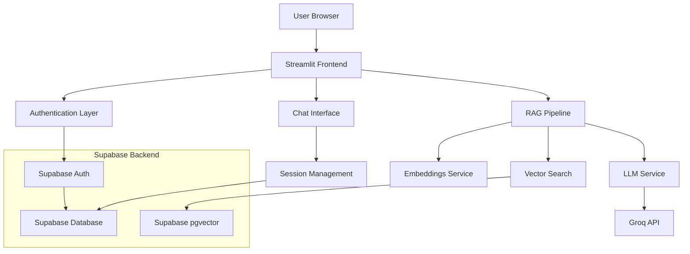

# Design Document

## Overview

The Pharmacology ChatGPT application is a sophisticated conversational AI system built with Streamlit that provides pharmacology-focused assistance through Retrieval-Augmented Generation (RAG). The application integrates user authentication, private conversation management, multiple AI model tiers, and a responsive UI supporting both light and dark themes.

The system leverages Langchain for orchestration, Supabase with pgvector for vector storage and retrieval, Groq models for AI inference, and Streamlit for the web interface. The architecture ensures user privacy through session-based authentication and user-scoped data access.

## Architecture

### High-Level Architecture



### Component Architecture

The application follows a modular architecture with clear separation of concerns:

1. **Frontend Layer**: Streamlit-based UI with responsive design
2. **Authentication Layer**: Supabase Auth integration with session management
3. **Business Logic Layer**: Chat management, RAG pipeline, user privacy enforcement
4. **Data Layer**: Supabase database with pgvector for embeddings and user data
5. **External Services**: Groq API for LLM inference

## Components and Interfaces

### 1. Authentication System

**Purpose**: Manage user registration, login, logout, and session persistence

**Key Components**:
- `AuthenticationManager`: Handles Supabase Auth integration
- `SessionManager`: Manages user sessions and state
- `UserManager`: User profile and preference management

**Interfaces**:
```python
class AuthenticationManager:
    def sign_up(email: str, password: str) -> AuthResult
    def sign_in(email: str, password: str) -> AuthResult  
    def sign_out() -> bool
    def get_current_user() -> Optional[User]
    def is_authenticated() -> bool

class SessionManager:
    def initialize_session(user_id: str) -> None
    def get_user_session() -> Optional[UserSession]
    def clear_session() -> None
```

### 2. Chat Management System

**Purpose**: Handle conversation flow, message storage, and user-scoped chat history

**Key Components**:
- `ChatManager`: Core chat functionality and message handling
- `MessageStore`: Database operations for chat messages
- `ConversationHistory`: User-scoped conversation retrieval

**Interfaces**:
```python
class ChatManager:
    def send_message(user_id: str, message: str, model_type: str) -> ChatResponse
    def get_conversation_history(user_id: str, limit: int) -> List[Message]
    def clear_conversation(user_id: str) -> bool

class MessageStore:
    def save_message(user_id: str, role: str, content: str) -> Message
    def get_user_messages(user_id: str) -> List[Message]
    def delete_user_messages(user_id: str) -> bool
```

### 3. RAG Pipeline

**Purpose**: Implement retrieval-augmented generation with vector search and context injection

**Key Components**:
- `RAGOrchestrator`: Coordinates retrieval and generation
- `VectorRetriever`: Handles semantic search using pgvector
- `ContextBuilder`: Constructs prompts with retrieved context
- `DocumentProcessor`: Handles document ingestion and chunking

**Interfaces**:
```python
class RAGOrchestrator:
    def process_query(user_id: str, query: str, model_type: str) -> RAGResponse
    def retrieve_context(query: str, k: int) -> List[Document]
    def generate_response(query: str, context: str, model: str) -> str

class VectorRetriever:
    def similarity_search(query: str, k: int, user_filter: str) -> List[Document]
    def add_documents(documents: List[Document], user_id: str) -> bool
```

### 4. Model Management

**Purpose**: Handle multiple AI model tiers and API interactions

**Key Components**:
- `ModelManager`: Manages model selection and API calls
- `GroqClient`: Groq API integration with streaming support
- `ModelConfig`: Configuration for different model tiers

**Interfaces**:
```python
class ModelManager:
    def get_available_models() -> List[ModelInfo]
    def generate_response(messages: List[Dict], model: str) -> Generator[str]
    def get_model_config(model_type: str) -> ModelConfig

class GroqClient:
    def stream_completion(messages: List[Dict], model: str) -> Generator[str]
    def get_completion(messages: List[Dict], model: str) -> str
```

### 5. UI Components

**Purpose**: Provide responsive, accessible interface with theme support

**Key Components**:
- `ThemeManager`: Handle light/dark mode switching
- `ChatInterface`: Main chat UI components
- `AuthInterface`: Login/signup forms
- `SettingsInterface`: User preferences and model selection

**Interfaces**:
```python
class ThemeManager:
    def apply_theme(theme: str) -> None
    def get_current_theme() -> str
    def toggle_theme() -> str

class ChatInterface:
    def render_chat_history(messages: List[Message]) -> None
    def render_message_input() -> Optional[str]
    def render_model_selector() -> str
```

## Data Models

### User Model
```python
@dataclass
class User:
    id: str
    email: str
    created_at: datetime
    preferences: Dict[str, Any]
    subscription_tier: str = "free"
```

### Message Model
```python
@dataclass
class Message:
    id: str
    user_id: str
    role: str  # "user" or "assistant"
    content: str
    model_used: Optional[str]
    created_at: datetime
    metadata: Dict[str, Any]
```

### Document Model
```python
@dataclass
class Document:
    id: str
    user_id: str  # For user-scoped documents
    content: str
    source: str
    metadata: Dict[str, Any]
    embedding: List[float]
    created_at: datetime
```

### Database Schema

**Users Table**:
```sql
CREATE TABLE users (
    id UUID PRIMARY KEY DEFAULT gen_random_uuid(),
    email TEXT UNIQUE NOT NULL,
    created_at TIMESTAMP WITH TIME ZONE DEFAULT NOW(),
    preferences JSONB DEFAULT '{}',
    subscription_tier TEXT DEFAULT 'free'
);
```

**Messages Table**:
```sql
CREATE TABLE messages (
    id UUID PRIMARY KEY DEFAULT gen_random_uuid(),
    user_id UUID REFERENCES users(id) ON DELETE CASCADE,
    role TEXT NOT NULL CHECK (role IN ('user', 'assistant')),
    content TEXT NOT NULL,
    model_used TEXT,
    created_at TIMESTAMP WITH TIME ZONE DEFAULT NOW(),
    metadata JSONB DEFAULT '{}'
);
```

**Documents Table** (with pgvector):
```sql
CREATE TABLE documents (
    id UUID PRIMARY KEY DEFAULT gen_random_uuid(),
    user_id UUID REFERENCES users(id) ON DELETE CASCADE,
    content TEXT NOT NULL,
    source TEXT NOT NULL,
    metadata JSONB DEFAULT '{}',
    embedding VECTOR(384), -- Adjust dimension based on embedding model
    created_at TIMESTAMP WITH TIME ZONE DEFAULT NOW()
);

CREATE INDEX ON documents USING ivfflat (embedding vector_cosine_ops);
```

## Error Handling

### Authentication Errors
- Invalid credentials: Display user-friendly error message
- Session expiry: Redirect to login with context preservation
- Network errors: Retry mechanism with exponential backoff

### RAG Pipeline Errors
- Vector database unavailable: Fallback to LLM-only mode
- Embedding service failure: Queue requests for retry
- Context too large: Implement intelligent truncation

### Model API Errors
- Rate limiting: Implement request queuing and user feedback
- Model unavailable: Automatic fallback to alternative model
- Timeout errors: Graceful degradation with partial responses

### Error Response Format
```python
@dataclass
class ErrorResponse:
    error_type: str
    message: str
    details: Optional[Dict[str, Any]]
    retry_after: Optional[int]
    fallback_available: bool
```

## Testing Strategy

### Unit Testing
- Authentication flow testing with mock Supabase client
- RAG pipeline component testing with sample documents
- Model API integration testing with mock responses
- UI component testing with Streamlit testing framework

### Integration Testing
- End-to-end user flows (signup → chat → logout)
- Database operations with test Supabase instance
- RAG pipeline with real embeddings and vector search
- Multi-user privacy verification

### Performance Testing
- Concurrent user load testing
- Vector search performance with large document sets
- Memory usage optimization for long conversations
- Response time benchmarking for different model tiers

### Security Testing
- User data isolation verification
- Authentication bypass attempts
- SQL injection prevention in vector queries
- API key exposure prevention

## Deployment Configuration

### Environment Variables
```bash
# Supabase Configuration
SUPABASE_URL=your_supabase_url
SUPABASE_ANON_KEY=your_anon_key
SUPABASE_SERVICE_KEY=your_service_key

# Groq API Configuration  
GROQ_API_KEY=your_groq_api_key
GROQ_FAST_MODEL=gemma2-9b-it
GROQ_PREMIUM_MODEL=qwen/qwen3-32b

# Application Configuration
APP_SECRET_KEY=your_secret_key
ENVIRONMENT=production
LOG_LEVEL=INFO
```

### Streamlit Cloud Configuration
- `requirements.txt` with all dependencies
- `.streamlit/config.toml` for UI customization
- Secrets management through Streamlit Cloud interface
- Health check endpoint for monitoring

### Database Setup
- Enable pgvector extension in Supabase
- Run migration scripts for table creation
- Set up Row Level Security (RLS) policies
- Configure database connection pooling