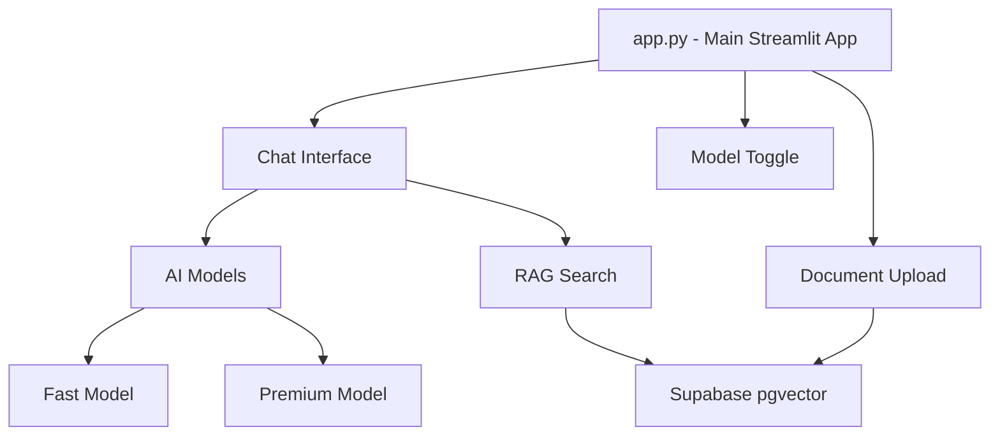

# Design Document

## Overview

A simple Streamlit chatbot with dark mode, model switching (fast/premium), and basic RAG using Langchain + Supabase. The design prioritizes simplicity with minimal files and straightforward functionality.

## Architecture



## Components and Interfaces

### Core Files (Minimal Set)
- **app.py**: Main Streamlit application with all UI components
- **models.py**: AI model implementations (fast and premium)
- **rag.py**: Document processing and vector search using Langchain
- **database.py**: Supabase connection and basic operations

## Data Models

### Simple Message Storage
- Store chat messages in Streamlit session state (no database persistence)
- Messages: `{"role": "user/assistant", "content": "text", "model": "fast/premium"}`

### Document Storage
- Single Supabase table for document chunks with embeddings
- Use Langchain's built-in vector store integration

## Database Schema

### Minimal Supabase Setup
```sql
-- Single table for document chunks and embeddings
CREATE TABLE document_chunks (
    id UUID PRIMARY KEY DEFAULT gen_random_uuid(),
    content TEXT NOT NULL,
    embedding VECTOR(1536),
    metadata JSONB,
    created_at TIMESTAMPTZ DEFAULT NOW()
);

-- Vector similarity search index
CREATE INDEX ON document_chunks USING ivfflat (embedding vector_cosine_ops);
```

## Error Handling

### Simple Error Strategy
- Display error messages directly in Streamlit UI
- Basic try/catch blocks around API calls
- Fallback to base model knowledge if RAG fails

## Testing Strategy

### Basic Testing
- Manual testing of chat functionality
- Test model switching
- Test document upload and retrieval
- Verify dark mode styling

## Performance Considerations

### Keep It Simple
- Use Streamlit session state for chat history
- Leverage Supabase's built-in vector search performance
- Minimal caching with Streamlit's native caching decorators