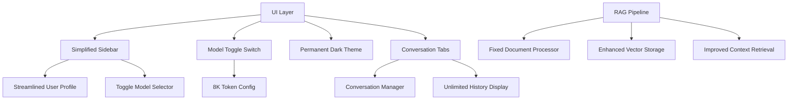

# Design Document

## Overview

This design document outlines the technical approach for enhancing the Pharmacology Chat Assistant's user interface. The enhancements focus on simplifying the sidebar, implementing a toggle-based model selection, enforcing permanent dark mode, increasing premium token limits, enabling unlimited conversation history, adding conversation management, and fixing the RAG document processing system.

The changes will improve user experience by reducing interface clutter, providing more intuitive controls, ensuring consistent theming, and fixing core functionality issues with document processing and context retrieval.

## Architecture

### Component Modifications

The enhancements will modify existing components rather than creating entirely new ones:

1. **Sidebar Simplification**: Remove unnecessary UI elements from the sidebar
2. **Model Selection Enhancement**: Replace dropdown with toggle switch
3. **Theme System Override**: Force dark mode throughout the application
4. **Token Configuration Update**: Increase premium model token limits
5. **Conversation Management**: Add unlimited history and conversation tabs
6. **RAG Pipeline Fix**: Repair document processing and context retrieval

### Modified Components



## Components and Interfaces

### 1. Simplified Sidebar Component

**Purpose**: Remove clutter and provide only essential controls

**Modifications**:
- Remove plan/subscription display
- Remove pagination controls
- Remove message count dropdowns
- Keep only user email, logout, and model toggle

**Interface Changes**:
```python
class SimplifiedSidebar:
    def render_user_profile_minimal(self) -> None:
        """Render minimal user profile without plan information"""
        
    def render_model_toggle_switch(self) -> str:
        """Render toggle switch for model selection"""
        
    def remove_pagination_controls(self) -> None:
        """Remove all pagination and message count controls"""
```

### 2. Model Toggle Switch Component

**Purpose**: Replace dropdown with intuitive toggle interface

**Design**:
- Visual toggle switch (left = Fast, right = Premium)
- Clear labels and visual feedback
- Immediate model switching
- Session persistence

**Interface**:
```python
class ModelToggleSwitch:
    def render_toggle_switch(self) -> Dict[str, Any]:
        """Render toggle switch with labels and state"""
        
    def handle_toggle_change(self, new_state: bool) -> None:
        """Handle toggle state changes and model switching"""
        
    def get_toggle_css(self) -> str:
        """Generate CSS for toggle switch styling"""
```

### 3. Permanent Dark Theme System

**Purpose**: Enforce consistent dark mode throughout the application

**Modifications**:
- Remove theme toggle functionality
- Override all theme configurations to dark mode
- Ensure high contrast and readability
- Update all color schemes

**Interface Changes**:
```python
class PermanentDarkTheme:
    def __init__(self):
        self.theme_config = self._get_dark_theme_config()
        
    def _get_dark_theme_config(self) -> ThemeConfig:
        """Return optimized dark theme configuration"""
        
    def apply_permanent_dark_theme(self) -> None:
        """Apply dark theme without toggle options"""
        
    def generate_dark_mode_css(self) -> str:
        """Generate comprehensive dark mode CSS"""
```

### 4. Enhanced Token Configuration

**Purpose**: Increase premium model token limits to 8,000

**Modifications**:
```python
class EnhancedModelConfig:
    def _initialize_model_configs(self):
        """Initialize model configurations with increased token limits"""
        self.model_configs = {
            ModelTier.FAST: ModelConfig(
                name="fast",
                display_name="Fast Mode",
                model_id="gemma2-9b-it",
                tier=ModelTier.FAST,
                max_tokens=1024,  # Keep existing
                temperature=0.0
            ),
            ModelTier.PREMIUM: ModelConfig(
                name="premium", 
                display_name="Premium Mode",
                model_id="qwen/qwen3-32b",
                tier=ModelTier.PREMIUM,
                max_tokens=8000,  # Increased from 2048
                temperature=0.0
            )
        }
```

### 5. Unlimited Conversation History

**Purpose**: Remove pagination and display complete conversation history

**Design**:
- Remove all pagination controls
- Load complete conversation history
- Implement efficient scrolling
- Optimize performance for long conversations

**Interface**:
```python
class UnlimitedConversationHistory:
    def render_unlimited_history(self, user_id: str) -> None:
        """Render complete conversation history without pagination"""
        
    def optimize_long_conversation_display(self) -> None:
        """Optimize performance for displaying long conversations"""
        
    def remove_pagination_ui(self) -> None:
        """Remove all pagination-related UI elements"""
```

### 6. Conversation Management System

**Purpose**: Add tabs for creating and managing multiple conversations

**Design**:
- Tab interface for conversation management
- New conversation creation
- Conversation switching
- Isolated conversation threads

**Interface**:
```python
class ConversationManager:
    def render_conversation_tabs(self, user_id: str) -> None:
        """Render tabs for managing conversations"""
        
    def create_new_conversation(self, user_id: str) -> str:
        """Create a new conversation thread"""
        
    def switch_conversation(self, user_id: str, conversation_id: str) -> None:
        """Switch to a different conversation"""
        
    def get_user_conversations(self, user_id: str) -> List[Conversation]:
        """Get all conversations for a user"""
```

### 7. Fixed RAG Document Processing

**Purpose**: Repair document upload, processing, and context retrieval

**Issues to Fix**:
- Document text extraction
- Embedding generation and storage
- Vector similarity search
- Context integration into prompts

**Enhanced Interface**:
```python
class FixedRAGPipeline:
    def process_uploaded_document(self, file, user_id: str) -> ProcessingResult:
        """Process uploaded document with proper error handling"""
        
    def extract_and_chunk_text(self, file) -> List[DocumentChunk]:
        """Extract text and create chunks from uploaded files"""
        
    def generate_and_store_embeddings(self, chunks: List[DocumentChunk], user_id: str) -> bool:
        """Generate embeddings and store in vector database"""
        
    def retrieve_relevant_context(self, query: str, user_id: str) -> List[DocumentChunk]:
        """Retrieve relevant document context for user queries"""
        
    def integrate_context_into_prompt(self, query: str, context: List[DocumentChunk]) -> str:
        """Integrate retrieved context into the AI prompt"""
```

## Data Models

### Conversation Model
```python
@dataclass
class Conversation:
    id: str
    user_id: str
    title: str
    created_at: datetime
    updated_at: datetime
    message_count: int
    is_active: bool
```

### Document Processing Result
```python
@dataclass
class ProcessingResult:
    success: bool
    document_id: Optional[str]
    chunks_created: int
    embeddings_stored: int
    error_message: Optional[str]
    processing_time: float
```

### Enhanced Model Configuration
```python
@dataclass
class EnhancedModelConfig:
    name: str
    display_name: str
    model_id: str
    tier: ModelTier
    max_tokens: int  # 8000 for premium
    temperature: float
    supports_streaming: bool
    context_window: int
```

## Database Schema Changes

### Conversations Table
```sql
CREATE TABLE conversations (
    id UUID PRIMARY KEY DEFAULT gen_random_uuid(),
    user_id UUID REFERENCES users(id) ON DELETE CASCADE,
    title TEXT NOT NULL DEFAULT 'New Conversation',
    created_at TIMESTAMP WITH TIME ZONE DEFAULT NOW(),
    updated_at TIMESTAMP WITH TIME ZONE DEFAULT NOW(),
    message_count INTEGER DEFAULT 0,
    is_active BOOLEAN DEFAULT true
);

CREATE INDEX idx_conversations_user_id ON conversations(user_id);
CREATE INDEX idx_conversations_active ON conversations(user_id, is_active);
```

### Enhanced Messages Table
```sql
-- Add conversation_id to existing messages table
ALTER TABLE messages ADD COLUMN conversation_id UUID REFERENCES conversations(id) ON DELETE CASCADE;

-- Create index for conversation-based queries
CREATE INDEX idx_messages_conversation ON messages(conversation_id, created_at);
```

### Document Processing Status
```sql
CREATE TABLE document_processing_status (
    id UUID PRIMARY KEY DEFAULT gen_random_uuid(),
    user_id UUID REFERENCES users(id) ON DELETE CASCADE,
    filename TEXT NOT NULL,
    status TEXT NOT NULL CHECK (status IN ('processing', 'completed', 'failed')),
    chunks_created INTEGER DEFAULT 0,
    embeddings_stored INTEGER DEFAULT 0,
    error_message TEXT,
    created_at TIMESTAMP WITH TIME ZONE DEFAULT NOW(),
    completed_at TIMESTAMP WITH TIME ZONE
);
```

## Error Handling

### Document Processing Errors
- File format validation
- Text extraction failures
- Embedding generation errors
- Vector storage failures
- User feedback for processing status

### Conversation Management Errors
- Conversation creation failures
- Switching between conversations
- Message loading errors
- Performance issues with large conversations

### Model Configuration Errors
- Token limit validation
- Model availability checks
- Fallback mechanisms for model failures

## Testing Strategy

### UI Component Testing
- Sidebar simplification verification
- Model toggle switch functionality
- Dark theme consistency across all components
- Conversation tab navigation

### RAG Pipeline Testing
- Document upload and processing
- Text extraction from various file formats
- Embedding generation and storage
- Context retrieval accuracy
- Integration with AI responses

### Performance Testing
- Unlimited conversation history loading
- Large document processing
- Multiple conversation management
- Memory usage optimization

### Integration Testing
- End-to-end document processing workflow
- Conversation creation and switching
- Model toggle with token limit changes
- Dark theme application across all pages

## Implementation Approach

### Phase 1: UI Simplification
1. Remove sidebar clutter (plan display, pagination controls)
2. Implement model toggle switch
3. Apply permanent dark theme

### Phase 2: Enhanced Functionality
1. Increase premium token limits to 8,000
2. Implement unlimited conversation history
3. Add conversation management tabs

### Phase 3: RAG System Fixes
1. Fix document processing pipeline
2. Repair embedding generation and storage
3. Enhance context retrieval and integration
4. Add proper error handling and user feedback

### Phase 4: Testing and Optimization
1. Comprehensive testing of all changes
2. Performance optimization
3. User experience validation
4. Bug fixes and refinements